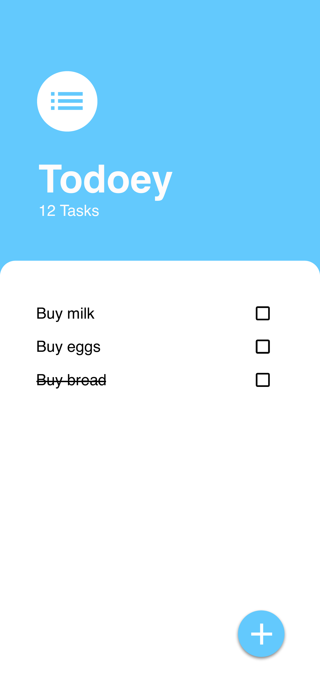
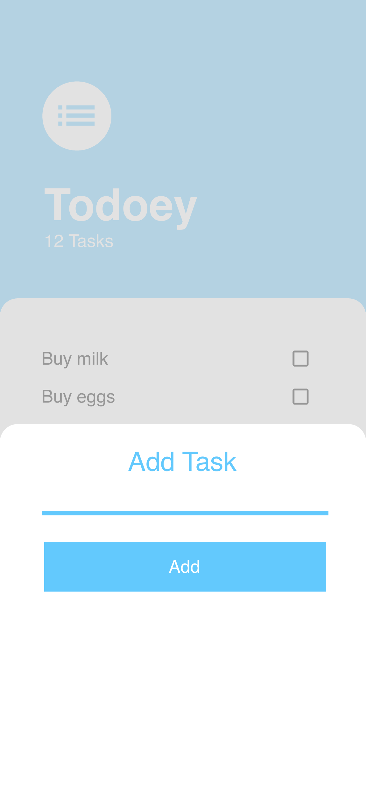

# 📝 Todoey

A beautiful and minimal Flutter To-Do application that helps you organize your daily tasks with an elegant Material Design interface.

<p align="center">
  
  
</p>

---

## ✨ Features

- 📋 View all your tasks
- ➕ Add new tasks using a bottom sheet
- ✅ Mark tasks as completed
- 🎨 Clean and modern UI
- 📱 Responsive Material Design
- ⚡ Built with Flutter

---

## 📸 Screenshots

| Home Screen | Add Task |
|-------------|----------|
|  |  |

---

## 🛠️ Built With

- Flutter
- Dart
- Material Design
- Stateful Widgets
- Modal Bottom Sheet

---

## 📂 Project Structure

```
lib/
├── main.dart
├── screens/
├── widgets/
├── models/
└── components/
```

---

## 🚀 Getting Started

### Prerequisites

- Flutter SDK
- Android Studio / VS Code
- Android Emulator or Physical Device

### Installation

```bash
git clone https://github.com/RaghuvanshAgarwal/todoey-flutter.git
```

```bash
cd todoey
```

Install packages

```bash
flutter pub get
```

Run the application

```bash
flutter run
```

---

## 📱 UI Preview

### Home Screen

- Displays all current tasks
- Shows the total task count
- Floating Action Button to add a new task

### Add Task

- Opens as a modal bottom sheet
- Text input for entering a task
- Add button to save the task

---

## 📚 What I Learned

- Stateful Widgets
- Flutter Layout System
- Floating Action Button
- Modal Bottom Sheets
- State Management Fundamentals
- Widget Composition
- Material Design Components

---

## 🎯 Future Improvements

- ☐ Delete tasks
- ☐ Edit existing tasks
- ☐ Persistent local storage
- ☐ Categories
- ☐ Dark Mode
- ☐ Due dates
- ☐ Notifications
- ☐ Cloud Sync

---

## 🤝 Contributing

Contributions, issues, and feature requests are welcome.

Feel free to fork the project and submit a pull request.

---

## 📄 License

This project is licensed under the MIT License.

---

## 👨‍💻 Author

**Raghuvansh Agarwal**

Game Developer • Flutter Learner • Unity Developer